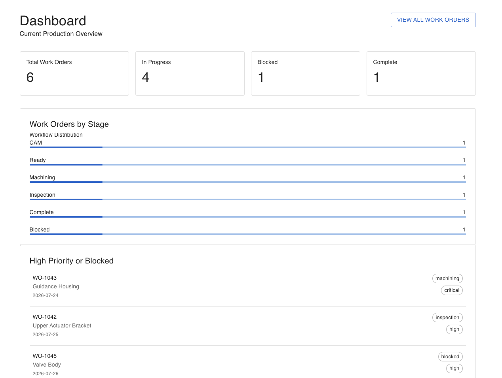

# Servo

A small manufacturing operations dashboard built with React, Typescript and MUI. Tracks work orders through their production lifecycle with blocked-state handling.

**[Live Demo](https://servo-ops-dashboard.vercel.app)**

## Stack

- React
- TypeScript
- Redux (Toolkit, React Router)
- Material UI
- Vitest + React Testing Library

## Features

- **Dashboard** — production overview: total/blocked/complete counts, stage distribution, and watchlist
- **Work Orders** — sortable, filterable list of all work orders
- **Work Order Details** — full detail view per order, with state change and reason for blocked state

## Getting Started

### Prerequisites
- Node.js 20+
- pnpm

### Installation
1. Clone the repository
2. Install dependencies: `pnpm install`
3. Start the dev server: `pnpm dev`
4. Open your browser to http://localhost:5173 or as listed in your terminal

### Project Structure

src/
├── app/ 
├── components/
├── features/
│ └── workOrders/
│ └── components/
├── pages/ Dashboard
│ └── Work Orders
│ └── Work Order Details
│ └── 404
└── services/ (unused - for API hookup. Currently wired to dummy data)

## Developer
For more information about this project, please contact Heather Hugo (github.com/sneauxgirl).
